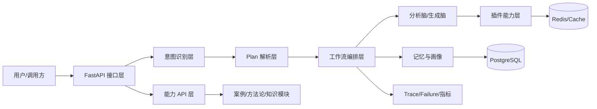

# AI 营销助手产品方案（V1）

## 1. 产品定位

AI 营销助手是一套面向中小品牌、内容团队与个人 IP 的智能营销工作台。产品核心目标是把「从想法到可执行内容」的链路拆解为标准化步骤，通过意图识别、固定/动态 Plan、工作流编排和插件能力，输出可解释、可追踪、可复用的营销结果。

产品定位关键词：
- 智能分析：对账号状态、内容方向、用户定位进行结构化分析。
- 智能创作：针对不同平台生成文案、脚本与策略草案。
- 决策辅助：以榜单、矩阵、周快照等形态支持持续运营决策。
- 可运营平台：支持 API 接入、数据回流、可观测与回归测试。

---

## 2. 目标用户与核心场景

### 2.1 用户分层

- 个人创作者：需要快速定位内容方向，持续获得选题和脚本建议。
- 品牌营销团队：需要统一策略、提升内容产能，并跟踪投放效果。
- 代运营机构：需要批量服务多个账号，要求流程标准化和可复盘。
- 产品/技术团队：通过 API 集成能力模块，建设自有业务系统。

### 2.2 核心场景

- 日常问答与闲聊：用户以自然语言与系统连续对话。
- 新账号冷启动：完成品牌/主题 Intake 后进入固定 Plan 执行。
- 内容矩阵构建：生成方向榜单、定位矩阵与阶段性建议。
- 账号异常诊断：针对流量/互动异常输出诊断与修复建议。
- 周期性复盘：通过每周决策快照追踪阶段、风险与优先级。

---

## 3. 产品目标与指标

### 3.1 业务目标

- 缩短策略制定时间：从人工小时级缩短到分钟级。
- 提升内容生产效率：在稳定质量前提下提升产能。
- 提高策略可执行性：输出内容由“建议”转向“可直接执行”。
- 强化系统可信度：提供 trace、失败码、回退链，支持定位问题。

### 3.2 建议 KPI

- 对话链路成功率：请求成功返回率、关键步骤成功率。
- 意图识别质量：闲聊误判率、任务意图召回率、JSON 解析失败率。
- Plan 稳定性：固定 Plan 命中率、被错误切走比例、锁定生效率。
- 内容产出效率：平均响应时长、首版可用率、二次修改率。
- 运营效果：用户留存、功能调用频次、能力模块使用深度。

---

## 4. 产品功能模块说明

## 4.1 对话与意图层

职责：识别用户输入意图，决定是闲聊、固定 Plan、动态 Plan 还是能力查询路径。

主要能力：
- 多类型意图识别（闲聊、结构化请求、自由讨论、文档问答、命令）。
- 明确生成诉求识别（`explicit_content_request`）。
- 简短闲聊保护，降低“继续/然后呢”等短句误判。
- 意图不可用显式报错（避免静默降级）。

对应实现：
- `core/intent/processor.py`
- `core/intent/intent_agent.py`

## 4.2 Plan 规划层（固定 + 动态）

职责：将用户需求转化为可执行步骤序列。

主要能力：
- 固定模板 Plan：账号打造、内容矩阵、IP 诊断、四能力模板。
- 动态 Plan：无固定匹配时由 `PlanningAgent` 生成步骤。
- 模板锁定机制：执行阶段支持 `locked_template_id` 防止被抢模版。
- 显式解锁机制：支持 `clear_template_lock=true` 解除锁定并重新解析。

对应实现：
- `plans/registry.py`
- `plans/templates/*.py`
- `workflows/ip_build_flow.py`

## 4.3 工作流编排层

职责：按 Plan 执行节点，组织分析、生成、检索、记忆与回退动作。

主要能力：
- 元工作流统一编排（含 trace_id、failure_code、思考日志）。
- 分析失败自动重试与插件回退链。
- 生成失败强制 `text_generator` 兜底。
- “继续短句”续跑已存在 Plan 的执行链路。

对应实现：
- `workflows/meta_workflow.py`
- `workflows/analysis_brain_subgraph.py`
- `workflows/generation_brain_subgraph.py`

## 4.4 插件能力层

职责：将热点、诊断、策略、生成等能力插件化，便于扩展。

主要能力：
- 分析脑插件：热点、定位、诊断、方向榜单、周快照等。
- 生成脑插件：文本、活动方案、图片、视频等生成能力。
- 定时与实时插件并存，统一由插件中心注册和调度。

对应实现：
- `core/brain_plugin_center.py`
- `plugins/`

## 4.5 Skill Runtime 层

职责：解决 Plan 插件命名漂移、回退链与分桶试验问题。

主要能力：
- 主名与别名（`*_plugin`）候选链归一。
- analyze/generate 回退链生成。
- `skill_ab_bucket` 稳定分桶，支持 A/B 报告分析。
- 固定 Plan 插件集合对齐校验。

对应实现：
- `core/skill_runtime.py`

## 4.6 记忆与用户画像层

职责：维护跨轮次上下文与长期偏好，提升回复连续性与个性化。

主要能力：
- 会话历史管理、近期对话摘要。
- 显式记忆写入（“记住...”）与画像快照更新。
- 基于用户画像辅助闲聊和任务路径回答。

对应实现：
- `domain/memory`
- `memory/session_manager.py`
- `services/memory*`（按当前工程组织）

## 4.7 能力 API 与数据闭环层

职责：对外提供标准能力接口并支持数据回流，形成优化闭环。

主要能力：
- 四模块能力 API：
  - 内容方向榜单
  - 定位决策案例库
  - 内容定位矩阵
  - 每周决策快照
- 数据闭环接口（反馈、案例、方法论管理等）。

对应实现：
- `routers/capability_api.py`
- `routers/data_and_knowledge.py`
- `modules/*`

---

## 5. 产品架构（逻辑视图）

### 5.1 分层职责

- 接口层：统一请求接入与鉴权（可扩展），暴露 REST 能力。
- 意图层：把自然语言转为机器可执行标签和结构化字段。
- Plan 层：在固定模板与动态规划之间做选择，支持锁定/解锁。
- 编排层：按步骤调度分析、生成、检索、记忆、回退。
- 能力层：插件化提供垂直能力，并按脑（analysis/generation）管理。
- 数据层：持久化会话、画像与缓存结果，保障性能与连续性。
- 观测层：trace_id、failure_code、metrics 支撑排障与运营。

---

## 6. 关键业务流程

### 6.1 新用户从闲聊到任务执行

1. 用户自然语言输入。
2. 意图层识别为闲聊/任务/结构化请求。
3. 任务进入 Plan 解析：
   - 命中固定模板：直接加载步骤并执行。
   - 否则动态规划：生成步骤后执行。
4. 执行过程中：
   - 成功则输出内容与建议。
   - 失败则触发回退链并记录 failure_code。
5. 结果写入会话与记忆，便于后续连续对话。

### 6.2 固定 Plan 执行中的切换控制

- 默认：执行中优先使用 `locked_template_id`。
- 用户明确退出/重选模板：
  - 传入 `clear_template_lock=true`。
  - intake/plan 阶段清理锁并重新选择模板。

### 6.3 诊断类流程

1. 用户表达账号问题（流量/数据/诊断）。
2. 解析为 `ip_diagnosis` 固定 Plan。
3. 执行 `account_diagnosis` 分析插件。
4. 输出诊断报告与下一步建议。

---

## 7. 对外功能清单（产品视角）

### 7.1 交互型能力

- 智能聊天与营销咨询。
- 深度分析与结构化建议输出。
- 多平台内容生成（文案/脚本等）。
- 会话恢复与历史上下文延续。

### 7.2 决策型能力（四模块）

- 内容方向榜单：方向优先级、风险、热度、角度建议。
- 案例库：可检索案例与策略参考。
- 定位矩阵：阶段化定位与内容边界。
- 周快照：阶段变化、风险点、优先级跟踪。

### 7.3 管理与运营能力

- 健康检查与指标监控。
- 回归脚本与自动化验证。
- 报告导出（Markdown）与链路排障。

---

## 8. 非功能方案

### 8.1 稳定性

- 关键节点失败码标准化（failure_code）。
- 插件回退链与重试策略。
- 意图识别异常时显式失败，防止错误执行。

### 8.2 可观测性

- 全链路 trace_id。
- 关键路径日志（意图、模板选择、步骤执行、回退动作）。
- `/metrics` 指标对接 Prometheus/Grafana。

### 8.3 可扩展性

- 插件中心按脑管理插件，新增能力无需改主流程。
- 固定 Plan 与动态 Plan 双轨并行，兼顾稳定与灵活。
- 模块化接口支持二次集成（案例、知识、方法论等）。

### 8.4 数据与安全（建议）

- 环境变量管理密钥（禁止提交 `.env`）。
- 会话与用户数据按业务等级做访问控制与审计（后续可加 RBAC）。
- 线上环境建议引入请求鉴权、速率限制与敏感词策略。

---

## 9. 版本规划建议

### V1（当前）

- 对话 + 意图 + 固定/动态 Plan 基本闭环。
- 四模块能力 API 上线。
- 失败可视化、回退、继续短句、skill runtime A/B 基础能力具备。

### V1.1（短期）

- 完善“退出/重选模板”前端交互契约（显式传 `clear_template_lock`）。
- 意图 JSON 解析兜底持续监控并优化提示词。
- 补齐更多场景回归模板与自动报告汇总脚本。

### V1.2（中期）

- 增强任务执行态管理（状态机可视化、中断恢复策略）。
- 结果质量评估闭环（自动评分 + 人工反馈融合）。
- 多租户与权限隔离、审计与合规能力增强。

---

## 10. 交付物与落地建议

### 10.1 产品文档交付物

- 本文档：产品方案主文档（定位、架构、模块、流程、规划）。
- API 文档：`docs/API_REFERENCE.md`
- 架构说明：`README.md` 与 `docs/ARCHITECTURE.md`（如需可进一步统一）
- 回归验证：`scripts/regression_plan_intent_long.py` 与报告输出。

### 10.2 落地建议（实施顺序）

1. 先固化前后端交互协议（尤其模板锁定/解锁字段）。
2. 对关键模块建立“日回归 + 版本回归”。
3. 建立线上指标看板（意图质量、模板命中、错误率、时延）。
4. 按业务优先级扩展插件与固定 Plan 模板库。

---

## 附录：模块到代码目录映射

- 接口入口：`main.py`
- 路由层：`routers/`
- 意图层：`core/intent/`
- Plan 层：`plans/`
- 工作流层：`workflows/`
- 插件层：`plugins/`
- 能力模块：`modules/`
- 记忆层：`memory/`、`domain/memory/`
- 配置与部署：`config/`、`docker-compose*.yml`、`Dockerfile*`
- 测试与脚本：`test/`、`scripts/`
