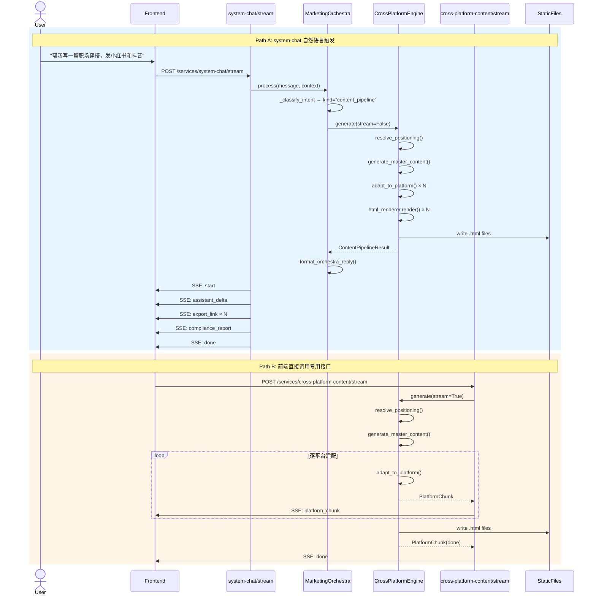

# 基于定位感知的多平台内容生成与 HTML 导出 Pipeline 设计方案

> **版本**: v2.0 | **状态**: 设计冻结，待编码实施 | **更新日期**: 2026-05-23  
> **评审报告**: `docs/CONTENT_PIPELINE_REVIEW_REPORT.md`  
> **目标**: 用户在 `system-chat` 中自然语言触发"生成+适配多平台"，系统自动获取/推断定位 → 生成母稿 → 平台适配 → 每篇存为 HTML

---

## 一、版本变更日志（Changelog）

### v1.0 → v2.0 变更摘要

| 章节 | 变更类型 | 说明 |
|------|---------|------|
| **一、版本变更日志** | **[新增]** | 新增 Changelog 章节，记录 v1.0 → v2.0 全部变更点 |
| **二、架构总览** | **[修改]** | 原方案建议直接替换一稿多改逻辑，现改为**抽离 `CrossPlatformEngine` 共用模块**，提供 `stream=True/False` 双模式 |
| **三、HTML 渲染管线** | **[修改]** | 增强 `HtmlRenderer`，新增字段兼容层、三平台差异化元信息卡片、封面文案区、CTA 区、合规水印区 |
| **四、静态存储方案** | **[修改]** | 原方案倾向数据库直存，现明确采用**短期 StaticFiles + 共享存储卷**方案，增加目录结构、URL 规则、清理策略 |
| **五、SSE Protocol v2.0** | **[新增]** | 新增独立章节，定义 `export_link`、`compliance_report` 专用事件类型，明确记忆隔离原则，提供客户端解析示例 |
| **六、接口契约更新** | **[新增]** | 新增 `stream_format=2` 完整契约定义，说明向后兼容策略 |
| **七、核心模块设计** | **[修改]** | 新增 `CrossPlatformEngine` 双模式设计、`UserProfileService` 定位推断优先级算法 |
| **八、数据模型** | **[修改]** | `content_exports` 表保留但降级为**元数据索引**，HTML 内容本身存 StaticFiles |
| **九、Prompt 增强** | **保持不变** | 母稿生成和平台适配 Prompt 设计已通过评审，v2.0 沿用 |
| **十、数据流时序图** | **[修改]** | 更新时序图，反映 Engine 抽离和 SSE v2.0 事件序列 |
| **十一、实施路线图** | **[修改]** | 更新 Roadmap，明确当前阶段（设计冻结）与下一阶段（编码实现）边界 |
| **十二、用户标签建议** | **保持不变** | 复用诊断 `account_gene` 作为标签基础的结论不变 |

### 需求实现状态

| 需求 | 实现状态 | 备注 |
|------|---------|------|
| R1 一稿多改迁移至 cross-platform-content | ✅ 设计完成 | 采用 Engine 抽离 + 双模式 |
| R2 Cross-Platform HTML 化 | ✅ 设计完成 | HtmlRenderer 增强版已定稿 |
| R3 System-Chat 单篇 HTML 化 | ✅ 设计完成 | 复用 Engine 母稿生成 + HtmlRenderer |
| R4 静态存储与链接回传 | ✅ 设计完成 | StaticFiles 短期方案 + 生产演进路径 |
| R5 SSE 协议升级 | ✅ 设计完成 | **首选方案**：新增独立事件类型，不混排 |

---

## 二、架构总览：CrossPlatformEngine 抽离

### 2.1 核心决策

**[修改]** 原 v1.0 方案建议在 `MarketingOrchestra._resolve_matrix_intent` 中直接替换调用逻辑，经专家组评审后确认**不可行**。v2.0 采用**Engine 抽离 + 双模式调用**架构。

**原因**：
- `_resolve_matrix_intent` 返回 `Dict[str, Any]`，`handle_cross_platform_content_stream` 返回 `AsyncIterator[str]`（SSE），接口契约不兼容
- `kind="content"` 时 `_should_use_agent_team()` 无条件返回 `True`，一稿多改请求优先走 AgentTeam 路径
- 直接替换会破坏 `system-chat` 的 SSE 格式和记忆隔离

### 2.2 分层架构

```
┌─────────────────────────────────────────────────────────────────┐
│                        接口层 (API Layer)                        │
│  ┌────────────────────┐    ┌──────────────────────────────────┐ │
│  │ system-chat/stream │    │ cross-platform-content/stream    │ │
│  │ (SSE v2.0)         │    │ (SSE platform_chunk + done)      │ │
│  │ assistant_delta    │    │                                  │ │
│  │ export_link        │    │                                  │ │
│  │ compliance_report  │    │                                  │ │
│  └────────┬───────────┘    └──────────┬───────────────────────┘ │
└───────────┼───────────────────────────┼───────────────────────┘
            │ stream=False              │ stream=True
            ▼                           ▼
┌─────────────────────────────────────────────────────────────────┐
│              业务逻辑层 (CrossPlatformEngine)                    │
│  ┌──────────────────────────────────────────────────────────┐   │
│  │  master_generator.py    → 母稿生成（注入定位信息）        │   │
│  │  platform_adaptor.py    → 逐平台适配（注入平台规则）      │   │
│  │  compliance_scanner.py  → 合规扫描                       │   │
│  │  html_renderer.py       → HTML 渲染（三平台差异化）       │   │
│  │  cross_platform_engine.py → 统一编排（stream 双模式）     │   │
│  └──────────────────────────────────────────────────────────┘   │
└─────────────────────────────────────────────────────────────────┘
            │
            ▼
┌─────────────────────────────────────────────────────────────────┐
│                      基础设施层 (Infra Layer)                    │
│  ┌──────────────┐  ┌──────────────┐  ┌──────────────────────┐  │
│  │ PlatformReg  │  │ Methodology  │  │ ServiceMemoryStore   │  │
│  │ (平台规则库) │  │ Registry     │  │ (对话记忆，仅存 NLG) │  │
│  └──────────────┘  └──────────────┘  └──────────────────────┘  │
│  ┌──────────────┐  ┌──────────────┐  ┌──────────────────────┐  │
│  │ StaticFiles  │  │ account_     │  │ content_exports      │  │
│  │ (HTML 存储)  │  │ profiles     │  │ (元数据索引)         │  │
│  └──────────────┘  └──────────────┘  └──────────────────────┘  │
└─────────────────────────────────────────────────────────────────┘
```

### 2.3 双模式调用设计

| 维度 | system-chat 调用（同步模式） | cross-platform-content 调用（流式模式） |
|------|---------------------------|--------------------------------------|
| 入口 | `MarketingOrchestra.run_dynamic` | `handle_cross_platform_content_stream` |
| Engine 参数 | `stream=False` | `stream=True` |
| Engine 返回 | `ContentPipelineResult` (dataclass) | `AsyncIterator[PlatformChunk]` |
| 上层包装 | `format_orchestra_reply()` → `stream_system_chat_v2_sse()` | 直接 `yield platform_chunk` |
| SSE 事件 | `assistant_delta` + `export_link` + `compliance_report` + `done` | `platform_chunk` + `done` |
| 记忆服务 | `service="system-chat"`，**仅存储 assistant_delta 文本** | `service="cross-platform-content"` |
| 适用场景 | 聊天中自然语言触发 | 前端直接调用专用接口 |

### 2.4 服务间调用时序图

> ⚠️ 2026-07-15：下图中 orchestra 内部的意图分类与 NLG 环节已决策退役，目标链路为 system-chat → Hermes planner → tool 调用（phase4 spec §3.1）



> **注**：Mermaid 语法在 Markdown 阅读器中可直接渲染，开发团队可参考此图理解调用关系。

---

## 三、HTML 渲染管线增强

### 3.1 输入输出契约

**[修改]** v2.0 对 `HtmlRenderer.render()` 的输入输出做了增强和约束。

```python
class HtmlRenderer:
    def render(
        self,
        content: Dict[str, Any],           # 输入：结构化内容数据
        positioning: Dict[str, Any],       # 输入：账号定位信息
        platform: str | None = None,       # 输入：平台标识（xiaohongshu/douyin/bilibili）
        is_master: bool = False,           # 输入：是否为母稿
    ) -> str:                              # 输出：完整 HTML 文档字符串
```

**输入字段兼容层**：

| 字段名 | 来源 | 兼容处理 |
|--------|------|---------|
| `body` | cross-platform-content 输出 | 主字段 |
| `content` | skill-creative-studio `generate_text` 输出 | Fallback：`content.get("body") or content.get("content", "")` |
| `title` | 所有来源 | 统一字段 |
| `hashtags` | 所有来源 | 统一字段 |
| `hook` | cross-platform-content | 可选，缺失时为空字符串 |
| `best_time` | cross-platform-content | 可选，缺失时为空字符串 |
| `compliance_warnings` | cross-platform-content 合规扫描 | 可选，缺失时为空列表 |
| `cover_copy` | skill-creative-studio | 可选，缺失时为空字符串 |
| `call_to_action` | skill-creative-studio | 可选，缺失时为空字符串 |

### 3.2 三平台差异化元信息卡片

**[新增]** 每个平台的 HTML 顶部（定位信息下方、正文上方）展示该平台特有的规范元信息卡片。

#### 小红书（xiaohongshu）

```html
<div class="platform-meta">
  <h4>📋 小红书平台规范</h4>
  <ul>
    <li>📐 图片比例：3:4（推荐）至 2:1 之间</li>
    <li>📸 建议图片数：6-9 张（最多 18 张）</li>
    <li>📏 图片分辨率：720×960 起</li>
    <li>📝 标题字数限制：20 字（图文）/ 64 字（视频）</li>
    <li>🏷️ 标签数量限制：最多 10 个</li>
  </ul>
</div>
```

#### 抖音（douyin）

```html
<div class="platform-meta">
  <h4>📋 抖音平台规范</h4>
  <ul>
    <li>⏱️ 建议视频时长：15-60 秒</li>
    <li>🎬 黄金3秒钩子：<strong>39.9的蓝牙耳机居然吊打百元款？</strong></li>
    <li>📐 视频比例：9:16 竖屏</li>
    <li>📏 视频分辨率：1080P 起</li>
    <li>🏷️ 标签数量限制：最多 5 个</li>
  </ul>
</div>
```

#### B站（bilibili）

```html
<div class="platform-meta">
  <h4>📋 B站平台规范</h4>
  <ul>
    <li>⏱️ 建议视频时长：1-10 分钟</li>
    <li>💬 弹幕互动引导：在关键转折点设置弹幕互动引导</li>
    <li>📝 标题字数限制：80 字（视频）</li>
    <li>🏷️ 标签数量限制：最多 10 个</li>
  </ul>
</div>
```

### 3.3 封面文案区与 CTA 渲染区

**[新增]** 当输入包含 `cover_copy` 或 `call_to_action` 时，在正文下方渲染专用区块。

```html
<!-- 封面文案区（仅当 cover_copy 非空时渲染） -->
<div class="cover-copy">
  <h4>📱 封面文案</h4>
  <p>预算有限也能爽！这5款超值好物闭眼入</p>
</div>

<!-- 行动号召区（仅当 call_to_action 非空时渲染） -->
<div class="cta">
  <h4>👉 行动号召</h4>
  <p>点击主页链接，获取更多平价好物推荐</p>
</div>
```

### 3.4 合规水印区

**[修改]** 合规结果展示增强为两种状态：

**通过状态**：
```html
<div class="compliance">
  ✅ 合规检查通过，未发现违规词
</div>
```

**警告状态**：
```html
<div class="compliance warning">
  ⚠️ 合规提醒：<br>
  • 命中 <mark>medical</mark> 类禁用词：疗效 → 建议替换为"效果"、"体验"<br>
  • 命中 <mark>comparison</mark> 类禁用词：最好 → 建议替换为"不错"、"推荐"
</div>
```

**设计原则**：
- 命中词用 `<mark>` 标签高亮，背景色 `#ffcc80`
- 每条 warning 后附加修改建议（"→ 建议替换为..."）
- 规则来源（category）用标签展示，便于用户理解违规类型

### 3.5 完整 HTML DOM 结构规范

```html
<!DOCTYPE html>
<html lang="zh-CN">
<head>
  <meta charset="UTF-8">
  <meta name="viewport" content="width=device-width, initial-scale=1.0">
  <title>{title}</title>
  <style>/* 内联 CSS，确保单文件可读 */</style>
</head>
<body>
  <!-- 1. 账号定位区（若 positioning 非空） -->
  <div class="positioning">...</div>

  <!-- 2. 文章标题 -->
  <h1>{title}</h1>

  <!-- 3. 标签区 -->
  <div class="tags">
    <span class="tag">#标签1</span>
    <span class="tag">#标签2</span>
  </div>

  <!-- 4. 平台规范元信息卡片（若 platform 非空） -->
  <div class="platform-meta">...</div>

  <!-- 5. 正文区 -->
  <article>{body}</article>

  <!-- 6. 封面文案区（若 cover_copy 非空） -->
  <div class="cover-copy">...</div>

  <!-- 7. 行动号召区（若 call_to_action 非空） -->
  <div class="cta">...</div>

  <!-- 8. 合规水印区 -->
  <div class="compliance">...</div>

  <!-- 9. 建议发布时间（若 best_time 非空） -->
  <p>🕐 建议发布时间：20:00</p>

  <!-- 10. 页脚 -->
  <footer>由 Lumina 智能营销助手生成 · 小红书版本</footer>
</body>
</html>
```

---

## 四、静态存储方案（短期）

### 4.1 核心决策

**[修改]** 采用专家组建议的**短期过渡方案**：`StaticFiles` + 共享存储卷。不上数据库直存 HTML 内容，数据库仅保留元数据索引（`content_exports` 表）。

**适用范围**：本地开发、单实例部署、短期测试环境。

**生产演进路径**：见 4.5 节。

### 4.2 目录结构

```
static/
└── content/                    # StaticFiles 挂载点：/static/content/
    └── 2026-05-23/             # 日期分区（YYYY-MM-DD）
        └── 97e91262-5346-481c-a325-338a37a7a6e5/   # request_id 分区
            ├── master.html     # 母稿
            ├── xiaohongshu.html   # 小红书适配稿
            ├── douyin.html        # 抖音适配稿
            └── bilibili.html      # B站适配稿
```

**命名规范**：

| 文件 | 命名规则 | 示例 |
|------|---------|------|
| 母稿 | `master.html` | `master.html` |
| 平台适配稿 | `{platform}.html` | `xiaohongshu.html`、`douyin.html`、`bilibili.html` |

**目录分区策略**：
- 一级分区：`{date}/` —— 按日期分目录，便于批量清理
- 二级分区：`{request_id}/` —— 同一请求的所有文件放在同一目录，便于关联管理
- 三级文件：`{platform}.html` —— 平台标识作为文件名

### 4.3 FastAPI StaticFiles 挂载

```python
# apps/api/src/api/main.py

from fastapi.staticfiles import StaticFiles
from pathlib import Path

_content_static = Path(__file__).resolve().parents[4] / "static" / "content"
_content_static.mkdir(parents=True, exist_ok=True)

app.mount(
    "/static/content",
    StaticFiles(directory=str(_content_static)),
    name="content_exports"
)
```

### 4.4 URL 生成规则

```python
def generate_export_url(
    request_id: str,
    platform: str | None,      # None 表示母稿
    base_url: str = "",        # 如 https://api.lumina.ai
    date: str | None = None,
) -> str:
    """生成 HTML 文件的外部访问 URL"""
    date = date or datetime.now().strftime("%Y-%m-%d")
    filename = f"{platform}.html" if platform else "master.html"

    # 返回相对路径或绝对 URL
    path = f"/static/content/{date}/{request_id}/{filename}"
    return f"{base_url}{path}" if base_url else path
```

**URL 示例**：

| 类型 | URL |
|------|-----|
| 母稿 | `https://api.lumina.ai/static/content/2026-05-23/97e91262-.../master.html` |
| 小红书版 | `https://api.lumina.ai/static/content/2026-05-23/97e91262-.../xiaohongshu.html` |
| 抖音版 | `https://api.lumina.ai/static/content/2026-05-23/97e91262-.../douyin.html` |

### 4.5 清理策略

**定时任务（建议用系统 cron 或 APScheduler）**：

```bash
# 每天凌晨 3 点执行，删除 30 天前的导出文件
0 3 * * * find /app/static/content -type d -mtime +30 -exec rm -rf {} + 2>/dev/null
```

**Python 实现（可选，集成到服务启动时）**：

```python
import shutil
from datetime import datetime, timedelta
from pathlib import Path

def cleanup_old_exports(exports_dir: Path, retention_days: int = 30):
    """清理过期导出文件"""
    cutoff = datetime.now() - timedelta(days=retention_days)
    for date_dir in exports_dir.iterdir():
        if not date_dir.is_dir():
            continue
        try:
            dir_date = datetime.strptime(date_dir.name, "%Y-%m-%d")
            if dir_date < cutoff:
                shutil.rmtree(date_dir)
        except ValueError:
            continue
```

### 4.6 生产环境演进路径

| 阶段 | 方案 | 触发条件 | 适配层设计 |
|------|------|---------|-----------|
| **短期**（当前） | StaticFiles + 共享存储卷 | 单实例/本地开发 | `FileSystemStorage`：直接读写本地文件 |
| **中期** | 对象存储（S3/OSS/MinIO） | 多实例/生产部署 | `ObjectStorage`：统一接口，底层换为 boto3/oss2 |
| **长期** | 对象存储 + CDN | 大规模分发 | `CDNStorage`：预签名 URL + 缓存失效策略 |

**存储抽象接口（预留）**：

```python
from abc import ABC, abstractmethod

class ContentStorage(ABC):
    """内容存储抽象接口，支持本地文件系统、对象存储等多种后端"""

    @abstractmethod
    async def save(self, request_id: str, platform: str | None, html: str) -> str:
        """保存 HTML，返回可访问 URL"""

    @abstractmethod
    async def get(self, url: str) -> str | None:
        """读取 HTML 内容"""

    @abstractmethod
    async def delete(self, request_id: str) -> bool:
        """删除指定 request_id 的所有文件"""
```

> **实施建议**：短期直接实现 `FileSystemStorage`，中期新增 `S3Storage` 或 `OSSStorage`，通过配置切换，不影响上层业务逻辑。

---

## 五、SSE Protocol v2.0 Specification

### 5.1 与 v1.0 的差异对比

| 维度 | SSE v1.0 | SSE v2.0（本方案） |
|------|---------|-------------------|
| `assistant_delta` | 可包含任意回复文本（包括链接、报告混排） | **仅限纯 NLG 对话文本** |
| 导出链接 | 无专用事件，混排在 `assistant_delta` 中 | 新增 `export_link` 专用事件 |
| 合规报告 | 无专用事件，混排在 `assistant_delta` 中 | 新增 `compliance_report` 专用事件 |
| 记忆持久化 | 存储全部 `assistant_delta` 内容 | **仅存储 `assistant_delta` 文本**，不存 `export_link` 和 `compliance_report` |
| 客户端解析 | 文本追加，无类型区分 | 按 `type` 字段路由到不同渲染器 |

### 5.2 完整事件类型定义

#### `start`

流开始标记。

```json
{
  "type": "start",
  "service": "system-chat",
  "stream_format": 2,
  "request_id": "97e91262-5346-481c-a325-338a37a7a6e5"
}
```

| 字段 | 类型 | 必填 | 说明 |
|------|------|------|------|
| `type` | string | ✅ | 固定值 `"start"` |
| `service` | string | ✅ | 服务标识 `"system-chat"` |
| `stream_format` | int | ✅ | 协议版本号，v2.0 固定为 `2` |
| `request_id` | string | ✅ | 本次请求唯一标识（UUID） |

#### `assistant_delta`

AI 对话文本片段，仅包含纯 NLG 生成的自然语言文本。

```json
{
  "type": "assistant_delta",
  "text": "好的，我已经根据你的要求，完成了这篇主打性价比的小红书种草笔记的初稿。"
}
```

| 字段 | 类型 | 必填 | 说明 |
|------|------|------|------|
| `type` | string | ✅ | 固定值 `"assistant_delta"` |
| `text` | string | ✅ | 纯文本片段，可直接用于打字机渲染 |

**约束**：
- 不包含 HTML 链接、Markdown 标记、JSON 结构
- 不包含合规报告内容
- 客户端应直接追加到对话气泡中

#### `export_link`

**[新增]** 生成内容的导出链接，当本次请求产出了 HTML 文章时推送。

```json
{
  "type": "export_link",
  "format": "html",
  "url": "/static/content/2026-05-23/97e91262-.../xiaohongshu.html",
  "platform": "xiaohongshu",
  "variant": "platform_adapt",
  "title": "预算有限也能爽！这5款超值好物闭眼入",
  "summary": "前3秒用悬念钩子提升点击",
  "platform_required_content": {
    "title": {"max_chars": 20, "min_chars": 1, "required": true},
    "content": {"max_chars": 1000, "min_chars": 1, "required": true},
    "pic_num": {"max": 18, "min": 1, "required": true}
  }
}
```

| 字段 | 类型 | 必填 | 说明 |
|------|------|------|------|
| `type` | string | ✅ | 固定值 `"export_link"` |
| `format` | string | ✅ | 文件格式，固定 `"html"` |
| `url` | string | ✅ | 可访问的完整 URL（相对或绝对） |
| `platform` | string | ✅ | 平台标识：`"xiaohongshu"` / `"douyin"` / `"bilibili"` / `"wechat_official"` / `"master"` |
| `variant` | string | ✅ | 内容变体类型：`"master"`（母稿）或 `"platform_adapt"`（平台适配稿） |
| `title` | string | ❌ | 文章标题，用于前端展示卡片标题 |
| `summary` | string | ✅ | 内容摘要，严格 20 个字符（不含标点） |
| `platform_required_content` | object / null | ✅ | 当前平台该内容类型下 `required: true` 的字段及其规范；`platform="master"` 时为 `null` |

**约束**：
- 一个平台一篇对应一个 `export_link` 事件
- 多平台适配时，会连续推送多个 `export_link`
- `summary` 由 LLM 生成并后处理，仅保留汉字/数字/字母，严格 ≤20 字符
- `platform_required_content` 从 `data/platforms/*.yml` 中按当前 `content_type` 提取
- **不作为对话历史的一部分持久化**

#### `compliance_report`

**[新增]** 合规审查结果，当本次请求包含内容生成时推送。

```json
{
  "type": "compliance_report",
  "risk_level": "low",
  "risk_categories": ["none"],
  "violations": [],
  "suggestion": "未发现明显违规词，内容可直接使用。",
  "format": "markdown",
  "report_md": "## ✅ 合规审查结果\n\n- **风险等级**：low\n- **风险类别**：none\n- **命中违规词**：无\n- **建议**：未发现明显违规词"
}
```

| 字段 | 类型 | 必填 | 说明 |
|------|------|------|------|
| `type` | string | ✅ | 固定值 `"compliance_report"` |
| `risk_level` | string | ✅ | 风险等级：`"low"` / `"medium"` / `"high"` |
| `risk_categories` | string[] | ✅ | 风险类别列表，如 `["none"]`、`["medical", "comparison"]` |
| `violations` | object[] | ✅ | 违规详情列表，每项含 `term`（命中词）、`category`（类别）、`suggestion`（建议替换词） |
| `suggestion` | string | ✅ | 审查结论摘要文本 |
| `format` | string | ✅ | 报告文本格式，固定 `"markdown"` |
| `report_md` | string | ✅ | 完整 Markdown 格式的审查报告，前端可直接渲染 |

**约束**：
- 一次请求通常只推送一个 `compliance_report`（汇总所有平台的扫描结果）
- **不作为对话历史的一部分持久化**

#### `done`

流结束标记，携带完整结构化数据。

```json
{
  "type": "done",
  "service": "system-chat",
  "request_id": "97e91262-5346-481c-a325-338a37a7a6e5",
  "full_length": 352,
  "reply_ms": 8405,
  "usage": {
    "prompt_tokens": 1230,
    "completion_tokens": 510,
    "total_tokens": 1740
  },
  "payload": {
    "layer": "orchestra",
    "mode": "dynamic",
    "intent": {"kind": "content_pipeline"},
    "has_content": true,
    "content_urls": [
      {"platform": "master", "url": "/static/content/.../master.html", "summary": "主打性价比的平价好物推荐清单", "platform_required_content": null},
      {"platform": "xiaohongshu", "url": "/static/content/.../xiaohongshu.html", "summary": "前3秒悬念钩子提升笔记点击率", "platform_required_content": {"title": {"max_chars": 20, "min_chars": 1, "required": true}, "content": {"max_chars": 1000, "min_chars": 1, "required": true}, "pic_num": {"max": 18, "min": 1, "required": true}}},
      {"platform": "douyin", "url": "/static/content/.../douyin.html", "summary": "黄金3秒制造价格反差好奇", "platform_required_content": {"title": {"max_chars": 55, "min_chars": 1, "required": true}, "video": {"required": true}, "content": {"required": true}}}
    ],
    "compliance": {
      "risk_level": "low",
      "risk_categories": ["none"],
      "violations": []
    },
    "hub": {
      "ok": true,
      "result": {
        "master_content": {...},
        "platform_versions": [...]
      }
    }
  }
}
```

| 字段 | 类型 | 必填 | 说明 |
|------|------|------|------|
| `type` | string | ✅ | 固定值 `"done"` |
| `service` | string | ✅ | 服务标识 `"system-chat"` |
| `request_id` | string | ✅ | 与 `start` 中的 `request_id` 一致 |
| `full_length` | int | ✅ | `assistant_delta` 文本总长度 |
| `reply_ms` | int | ✅ | 从收到请求到生成完成耗时（毫秒） |
| `usage` | object | ❌ | Token 用量统计 |
| `payload` | object | ✅ | 完整业务数据，含 `has_content`、`content_urls`、`compliance`、`hub` 等 |

**v2.0 payload 新增字段**：

| 字段 | 类型 | 说明 |
|------|------|------|
| `has_content` | bool | 本次请求是否生成了内容（ true = 有文章，false = 纯对话） |
| `content_urls` | object[] | 所有导出文件的 URL 列表，每项含 `platform` 和 `url` |
| `compliance` | object | 合规结果摘要，结构与 `compliance_report` 一致 |

### 5.3 完整 SSE 流示例

```sse
data: {"type": "start", "service": "system-chat", "stream_format": 2, "request_id": "97e91262-5346-481c-a325-338a37a7a6e5"}

data: {"type": "assistant_delta", "text": "好的，我已经根据你的要求，完成了这篇主打性价比的小红书种草笔记的初稿，并同步进行了合规审查，确保内容安全可发布。"}

data: {"type": "assistant_delta", "text": "这篇笔记的标题是《预算有限也能爽！这5款超值好物闭眼入》，内容围绕蓝牙耳机、防晒喷雾等5款平价好物展开，整体风险等级为低，没有发现违规词，可以直接使用。"}

data: {"type": "assistant_delta", "text": "你特别关心的"性价比"和"内容吸引力"方面，笔记采用了"好奇型"开头，并在前3秒用"宝藏平台"和"便宜到离谱"制造悬念，能有效提升点击率。"}

data: {"type": "export_link", "format": "html", "url": "https://api.lumina.ai/static/content/2026-05-23/97e91262-.../master.html", "platform": "master", "variant": "master", "title": "预算有限也能爽！这5款超值好物闭眼入", "summary": "主打性价比的平价好物推荐清单", "platform_required_content": null}

data: {"type": "export_link", "format": "html", "url": "https://api.lumina.ai/static/content/2026-05-23/97e91262-.../xiaohongshu.html", "platform": "xiaohongshu", "variant": "platform_adapt", "title": "预算有限也能爽！这5款超值好物闭眼入", "summary": "前3秒悬念钩子提升笔记点击率", "platform_required_content": {"title": {"max_chars": 20, "min_chars": 1, "required": true}, "content": {"max_chars": 1000, "min_chars": 1, "required": true}, "pic_num": {"max": 18, "min": 1, "required": true}}}

data: {"type": "export_link", "format": "html", "url": "https://api.lumina.ai/static/content/2026-05-23/97e91262-.../douyin.html", "platform": "douyin", "variant": "platform_adapt", "title": "39.9的蓝牙耳机居然吊打百元款？", "summary": "黄金3秒制造价格反差好奇", "platform_required_content": {"title": {"max_chars": 55, "min_chars": 1, "required": true}, "video": {"required": true}, "content": {"required": true}}}

data: {"type": "compliance_report", "risk_level": "low", "risk_categories": ["none"], "violations": [], "suggestion": "未发现明显违规词，内容可直接使用。", "format": "markdown", "report_md": "## ✅ 合规审查结果\n\n- **风险等级**：low\n- **风险类别**：none\n- **命中违规词**：无\n- **建议**：未发现明显违规词"}

data: {"type": "done", "service": "system-chat", "request_id": "97e91262-5346-481c-a325-338a37a7a6e5", "full_length": 2156, "reply_ms": 8405, "usage": {"prompt_tokens": 1230, "completion_tokens": 510, "total_tokens": 1740}, "payload": {"layer": "orchestra", "mode": "dynamic", "intent": {"kind": "content_pipeline"}, "has_content": true, "content_urls": [{"platform": "master", "url": "https://api.lumina.ai/static/content/2026-05-23/97e91262-.../master.html"}, {"platform": "xiaohongshu", "url": "https://api.lumina.ai/static/content/2026-05-23/97e91262-.../xiaohongshu.html"}, {"platform": "douyin", "url": "https://api.lumina.ai/static/content/2026-05-23/97e91262-.../douyin.html"}], "compliance": {"risk_level": "low", "risk_categories": ["none"], "violations": []}, "hub": {"ok": true, "result": {"master_content": {"title": "预算有限也能爽！这5款超值好物闭眼入", "content": "..."}, "platform_versions": [{"platform": "xiaohongshu", "title": "...", "body": "..."}, {"platform": "douyin", "title": "...", "body": "..."}]}}}}
```

### 5.4 客户端解析示例

#### JavaScript 前端解析

```javascript
// 建立 SSE 连接
const eventSource = new EventSource('/api/v1/services/system-chat/stream');

let assistantText = '';
const exportLinks = [];
let complianceReport = null;

eventSource.onmessage = (event) => {
  const data = JSON.parse(event.data);

  switch (data.type) {
    case 'start':
      console.log('Stream started, request_id:', data.request_id);
      break;

    case 'assistant_delta':
      // 打字机效果：追加文本到对话气泡
      assistantText += data.text;
      updateChatBubble(assistantText);
      break;

    case 'export_link':
      // 渲染为可点击卡片
      exportLinks.push(data);
      renderExportCard(data);
      break;

    case 'compliance_report':
      // 渲染为折叠面板
      complianceReport = data;
      renderCompliancePanel(data);
      break;

    case 'done':
      // 流结束，保存完整数据
      console.log('Stream done, payload:', data.payload);
      eventSource.close();
      break;

    case 'error':
      console.error('Stream error:', data.message);
      eventSource.close();
      break;
  }
};

function renderExportCard(link) {
  const card = document.createElement('div');
  card.className = 'export-card';
  card.innerHTML = `
    <span class="platform-badge">${link.platform}</span>
    <a href="${link.url}" target="_blank" class="export-link">
      📄 ${link.title || '查看文章'}
    </a>
  `;
  document.getElementById('chat-container').appendChild(card);
}

function renderCompliancePanel(report) {
  const panel = document.createElement('div');
  panel.className = `compliance-panel ${report.risk_level}`;
  panel.innerHTML = `
    <details>
      <summary>✅ 合规审查：${report.risk_level}</summary>
      <div class="compliance-body">${markdownToHtml(report.report_md)}</div>
    </details>
  `;
  document.getElementById('chat-container').appendChild(panel);
}
```

#### Python 服务端解析示例

```python
import json
from typing import Iterator, Dict, Any

def parse_sse_stream(lines: Iterator[str]) -> Iterator[Dict[str, Any]]:
    """解析 SSE 流，按事件类型 yield"""
    for line in lines:
        if not line.startswith("data: "):
            continue
        data = json.loads(line[6:])  # 去掉 "data: " 前缀
        yield data

# 使用示例
for event in parse_sse_stream(response.iter_lines()):
    if event["type"] == "assistant_delta":
        print("NLG:", event["text"])
    elif event["type"] == "export_link":
        print(f"Export: {event['platform']} -> {event['url']}")
    elif event["type"] == "compliance_report":
        print(f"Compliance: {event['risk_level']}")
    elif event["type"] == "done":
        print("Done, payload:", event["payload"])
```

### 5.5 记忆隔离原则

**[新增]** 明确对话记忆（Memory）与实时推送（SSE）的边界：

| 数据类型 | 存储位置 | 存储内容 | 是否进入对话历史 |
|---------|---------|---------|----------------|
| `assistant_delta` 文本 | `ServiceMemoryStore` (service="system-chat") | 纯 NLG 对话文本 | ✅ 是 |
| `export_link` | 不存储 | 仅在 SSE 流中实时推送 | ❌ 否 |
| `compliance_report` | 不存储 | 仅在 SSE 流中实时推送 | ❌ 否 |
| `done.payload` | 不存储 | 仅在 SSE 流中一次性推送 | ❌ 否（但 `content_exports` 表保留元数据索引） |

**实现要点**：

```python
async def stream_system_chat_v2_sse(...):
    # ... start 帧 ...

    # 1. 输出 NLG 文本（存入记忆）
    reply_text = extract_display_reply(result)
    async for piece in _stream_text_chunks(reply_text, STREAM_CHUNK):
        yield _sse({"type": "assistant_delta", "text": piece})
    await append_assistant(reply_text)  # ← 仅保存 NLG 文本

    # 2. 输出 export_link（不存入记忆）
    for url_info in result.get("export_urls", []):
        yield _sse({
            "type": "export_link",
            "format": "html",
            "url": url_info["url"],
            "platform": url_info["platform"],
            "variant": url_info["variant"],
        })

    # 3. 输出 compliance_report（不存入记忆）
    compliance = result.get("compliance", {})
    if compliance:
        yield _sse({
            "type": "compliance_report",
            "risk_level": compliance["risk_level"],
            "risk_categories": compliance["risk_categories"],
            "violations": compliance.get("violations", []),
            "suggestion": compliance["suggestion"],
            "format": "markdown",
            "report_md": compliance["report_md"],
        })

    # 4. 输出 done
    yield _sse({"type": "done", ...})
```

---

## 六、接口契约更新

### 6.1 请求定义

**`POST /api/v1/services/system-chat/stream`**

请求头：
```http
Content-Type: application/json
X-Lumina-Stream-Format: 2      # 可选，启用 v2.0 协议；未指定时默认 v1.0
```

请求体（`ServiceStreamRequest`）：
```json
{
  "user_id": "user-001",
  "conversation_id": "conv-001",
  "message": "帮我写一篇职场穿搭，发小红书和抖音",
  "platform": "xiaohongshu",
  "context": {
    "target_platforms": ["xiaohongshu", "douyin"],
    "content_type": "图文",
    "positioning_statement": "专注25-35岁职场女性的穿搭博主",
    "target_persona": {"age": "25-35", "gender": "女性", "pain_points": ["通勤穿搭难", "预算有限"]},
    "content_pillars": ["通勤搭配", "单品推荐", "场合穿搭"],
    "industry": "fashion",
    "content_dna": {"tone": "亲和", "style": "干货"}
  },
  "stream_format": 2
}
```

**[新增]** `context` 中可选字段：

| 字段 | 类型 | 说明 |
|------|------|------|
| `target_platforms` | string[] | 目标平台列表，如 `["xiaohongshu", "douyin"]` |
| `content_type` | string | 内容类型：`"图文"` / `"视频"` / `"脚本"`，默认 `"图文"` |
| `positioning_statement` | string | 用户显式提供的定位声明 |
| `target_persona` | object | 用户显式提供的人群画像 |
| `content_pillars` | string[] | 用户显式提供的内容支柱 |

### 6.2 响应定义

响应类型：`text/event-stream`

响应体：SSE v2.0 事件流，详见第五章。

### 6.3 向后兼容说明

**[新增]** `stream_format` 启用逻辑：

| 条件 | 行为 |
|------|------|
| `stream_format=2`（请求体或请求头） | 启用 SSE v2.0，输出 `export_link` + `compliance_report` |
| `stream_format=1` 或未指定 | 保持 v1.0 行为，不输出新事件类型 |
| 前端未识别新事件类型 | 安全忽略 `export_link` 和 `compliance_report`，不影响对话渲染 |

**兼容性保证**：
- v2.0 的 `assistant_delta` 格式与 v1.0 完全一致，前端无需修改即可兼容
- 新增事件类型（`export_link`、`compliance_report`）是**扩展性添加**，不影响旧客户端
- 旧客户端收到未知事件类型时，应安全忽略（`default` 分支处理）

### 6.4 `POST /api/v1/services/cross-platform-content/stream`

请求体扩展（新增可选字段，与 system-chat 的 `context` 对齐）：

```json
{
  "user_id": "user-001",
  "conversation_id": "conv-001",
  "message": "职场穿搭",
  "platform": "xiaohongshu",
  "context": {
    "target_platforms": ["xiaohongshu", "douyin"],
    "content_type": "图文",
    "positioning_statement": "...",
    "target_persona": {...},
    "content_pillars": [...],
    "master_content": {"title": "...", "content": "..."}
  }
}
```

---

## 七、核心模块设计

### 7.1 CrossPlatformEngine

**[修改]** 支持 `stream=True/False` 双模式。

```python
# apps/api/src/services/content_engine/cross_platform_engine.py

from dataclasses import dataclass
from typing import Dict, List, Any, AsyncIterator, Union

@dataclass
class PlatformChunk:
    type: str           # "master" | "platform"
    platform: str | None
    content: Dict[str, Any]
    warnings: List[str] | None = None

@dataclass
class ContentPipelineResult:
    master_content: Dict[str, Any]
    platform_versions: List[Dict[str, Any]]
    positioning: Dict[str, Any]
    export_urls: List[Dict[str, str]]
    compliance: Dict[str, Any]

class CrossPlatformEngine:
    def __init__(self):
        self.master_gen = MasterGenerator()
        self.platform_adaptor = PlatformAdaptor()
        self.compliance_scanner = ComplianceScanner()
        self.html_renderer = HtmlRenderer()
        self.profile_service = UserProfileService()
        self.storage = FileSystemStorage()  # 短期方案：本地文件系统

    async def generate(
        self,
        user_id: str,
        conversation_id: str,
        message: str,
        target_platforms: List[str],
        context: Dict[str, Any],
        session_history: List[Dict[str, Any]],
        stream: bool = False,
        request_id: str = "",
    ) -> Union[ContentPipelineResult, AsyncIterator[PlatformChunk]]:

        positioning = await self.profile_service.resolve_positioning(
            user_id, target_platforms[0], context, session_history
        )

        master_content = await self.master_gen.generate(
            message=message,
            positioning=positioning,
            seed_topic=context.get("seed_topic"),
            user_position=context.get("user_position"),
            content_type=context.get("content_type", "图文"),
        )

        if stream:
            yield PlatformChunk(type="master", platform=None, content=master_content)

        platform_versions = []
        all_warnings = []

        for platform in target_platforms:
            version = await self.platform_adaptor.adapt(
                master_content=master_content,
                platform=platform,
                positioning=positioning,
                content_type=context.get("content_type", "图文"),
            )

            warnings = self.compliance_scanner.scan(
                version.get("title", "") + version.get("body", version.get("content", "")),
                platform=platform,
            )
            if warnings:
                version["compliance_warnings"] = warnings
                all_warnings.extend(warnings)

            version = self._inject_platform_specific_fields(version, platform)

            # 生成 HTML 并保存
            html = self.html_renderer.render(version, positioning, platform=platform)
            url = await self.storage.save(
                request_id=request_id,
                platform=platform,
                html=html,
            )
            version["export_url"] = url

            if stream:
                yield PlatformChunk(type="platform", platform=platform, content=version, warnings=warnings)
            else:
                platform_versions.append(version)

        # 母稿 HTML
        master_html = self.html_renderer.render(master_content, positioning, is_master=True)
        master_url = await self.storage.save(
            request_id=request_id,
            platform=None,
            html=master_html,
        )

        # 合规汇总
        compliance = self._aggregate_compliance(all_warnings)

        if not stream:
            export_urls = [
                {"platform": "master", "url": master_url, "variant": "master"},
            ]
            for v in platform_versions:
                export_urls.append({
                    "platform": v["platform"],
                    "url": v["export_url"],
                    "variant": "platform_adapt",
                })

            return ContentPipelineResult(
                master_content=master_content,
                platform_versions=platform_versions,
                positioning=positioning,
                export_urls=export_urls,
                compliance=compliance,
            )
```

### 7.2 UserProfileService

详见 v1.0 文档第三章 3.1 节，v2.0 沿用不变。

### 7.3 FileSystemStorage（短期实现）

**[新增]**

```python
# apps/api/src/services/content_engine/storage.py

from pathlib import Path
from datetime import datetime

class FileSystemStorage:
    """短期方案：本地文件系统存储，支持后续迁移到对象存储"""

    def __init__(self, base_dir: Path | None = None):
        self.base_dir = base_dir or Path(__file__).resolve().parents[4] / "static" / "content"
        self.base_dir.mkdir(parents=True, exist_ok=True)

    async def save(self, request_id: str, platform: str | None, html: str) -> str:
        date_dir = datetime.now().strftime("%Y-%m-%d")
        request_dir = self.base_dir / date_dir / request_id
        request_dir.mkdir(parents=True, exist_ok=True)

        filename = f"{platform}.html" if platform else "master.html"
        file_path = request_dir / filename
        file_path.write_text(html, encoding="utf-8")

        return f"/static/content/{date_dir}/{request_id}/{filename}"

    async def get(self, url: str) -> str | None:
        # url 格式: /static/content/{date}/{request_id}/{filename}.html
        relative_path = url.replace("/static/content/", "")
        file_path = self.base_dir / relative_path
        if file_path.exists():
            return file_path.read_text(encoding="utf-8")
        return None
```

---

## 八、数据模型

### 8.1 账号定位表 `account_profiles`

与 v1.0 一致，详见第一章 2.1 节。

### 8.2 内容母稿与终稿表 `contents`

与 v1.0 一致，详见第一章 2.2 节。

### 8.3 HTML 导出元数据表 `content_exports`

**[修改]** v2.0 中本表降级为**元数据索引**，HTML 内容本身存 StaticFiles。

```sql
CREATE TABLE IF NOT EXISTS content_exports (
    id UUID PRIMARY KEY DEFAULT uuid_generate_v4(),
    user_id TEXT NOT NULL,
    conversation_id TEXT NOT NULL,
    request_id TEXT NOT NULL,              -- 新增：关联 SSE request_id
    content_id UUID REFERENCES contents(id) ON DELETE CASCADE,

    export_type VARCHAR(50) NOT NULL,      -- 'master', 'xiaohongshu', 'douyin', 'bilibili'
    article_title TEXT,
    file_path TEXT NOT NULL,               -- [修改] 改为存储文件路径，不存 HTML 内容
    file_size INTEGER,                     -- 新增：文件大小（字节）
    raw_payload JSONB,                     -- 原始结构化数据备份

    created_at TIMESTAMP WITH TIME ZONE DEFAULT NOW()
);

CREATE INDEX idx_exports_user ON content_exports(user_id, created_at DESC);
CREATE INDEX idx_exports_conv ON content_exports(conversation_id);
CREATE INDEX idx_exports_request ON content_exports(request_id);  -- 新增
```

**设计变更说明**：
- `html_content TEXT` → `file_path TEXT`：HTML 内容存 StaticFiles，数据库存路径
- 新增 `request_id`：关联 SSE 流，便于按请求追踪所有导出文件
- 新增 `file_size`：便于存储管理和监控

---

## 九、Prompt 增强设计

与 v1.0 一致，详见原文档第四章。v2.0 沿用不变。

---

## 十、数据流时序图

### 10.1 system-chat 触发一稿多改（SSE v2.0）

> ⚠️ 2026-07-15：下图中 orchestra 内部的意图分类与 NLG 环节已决策退役，目标链路为 system-chat → Hermes planner → tool 调用（phase4 spec §3.1）

```text
User: "帮我写一篇职场穿搭，发小红书和抖音"
  │
  ▼
[POST /api/v1/services/system-chat/stream (stream_format=2)]
  │
  ├── SSE: start {request_id: "..."}
  │
  ├── MarketingOrchestra.process()
  │     ├── _classify_intent → kind="content_pipeline"
  │     └── run_dynamic
  │         └── CrossPlatformEngine.generate(stream=False)
  │             ├── resolve_positioning() → 定位信息
  │             ├── generate_master_content() → 母稿
  │             ├── adapt_to_platform("xiaohongshu") → 小红书版
  ���             ├── adapt_to_platform("douyin") → 抖音版
  │             ├── html_renderer.render() × 3 → 3 个 HTML
  │             ├── storage.save() × 3 → StaticFiles
  │             └── return ContentPipelineResult
  │         └── format_orchestra_reply() → NLG 文本
  │
  ├── SSE: assistant_delta "好的，我已经根据你的要求..."
  ├── SSE: assistant_delta "这篇笔记的标题是..."
  ├── SSE: assistant_delta "整体风险等级为低..."
  │
  ├── SSE: export_link {platform: "master", url: "/static/content/.../master.html"}
  ├── SSE: export_link {platform: "xiaohongshu", url: "/static/content/.../xiaohongshu.html"}
  ├── SSE: export_link {platform: "douyin", url: "/static/content/.../douyin.html"}
  │
  ├── SSE: compliance_report {risk_level: "low", violations: [], ...}
  │
  ├── SSE: done {payload: {has_content: true, content_urls: [...], compliance: {...}, hub: {...}}}
  │
  └── 记忆落库：仅保存 assistant_delta 的 NLG 文本
```

### 10.2 cross-platform-content 直接调用（流式模式）

```text
Frontend: [POST /api/v1/services/cross-platform-content/stream]
  │
  ├── SSE: start
  ├── SSE: platform_chunk {type: "master", content: {...}}
  ├── SSE: platform_chunk {type: "platform", platform: "xiaohongshu", content: {...}}
  ├── SSE: platform_chunk {type: "platform", platform: "douyin", content: {...}}
  ├── SSE: done {payload: {reply: "...", platforms: [...], exports: [...]}}
  │
  └── HTML 文件已写入 static/content/{date}/{request_id}/
```

---

## 十一、实施路线图（Roadmap）

### 当前阶段：设计冻结（Design Freeze）

> **状态**：✅ 已完成  
> **日期**：2026-05-23  
> **产出**：`CONTENT_PIPELINE_DESIGN.md` v2.0、`CONTENT_PIPELINE_REVIEW_REPORT.md`

### 下一阶段：编码实现（Implementation）

| 优先级 | 模块 | 任务 | 预估工期 | 验收标准 |
|--------|------|------|---------|---------|
| **P0** | 基础设施 | 追加 `account_profiles`、`content_exports` 表；扩展 `contents` 表 | 0.5 天 | SQL 脚本可执行，表结构符合设计 |
| **P0** | Engine | 新建 `CrossPlatformEngine` 目录结构，实现 `master_generator.py`、`platform_adaptor.py`、`compliance_scanner.py` | 1.5 天 | 单测通过，Prompt 注入定位信息正确 |
| **P0** | HTML 渲染 | 实现 `html_renderer.py`，支持三平台差异化、字段兼容、合规水印 | 0.5 天 | 输出 HTML 文件符合 DOM 结构规范 |
| **P0** | 存储 | 实现 `FileSystemStorage`，目录结构符合 `{date}/{request_id}/{platform}.html` | 0.5 天 | 文件可读写，URL 可访问 |
| **P1** | 定位服务 | 实现 `UserProfileService`，支持 P0-P4 优先级推断 | 1 天 | 单元测试覆盖所有推断路径 |
| **P1** | system-chat | 新增 `content_pipeline` 意图，集成 Engine（stream=False），输出 SSE v2.0 | 1 天 | 端到端测试通过，记忆仅存 NLG 文本 |
| **P1** | SSE 协议 | 实现 `export_link`、`compliance_report` 事件类型，更新 `stream_system_chat_v2_sse` | 0.5 天 | 客户端解析示例可正常运行 |
| **P2** | cross-platform-content | 复用 Engine（stream=True），废弃内部独立逻辑 | 0.5 天 | 与 system-chat 输出质量一致 |
| **P2** | generate_text | 单篇生成复用 Engine 母稿生成 + HTML 渲染 | 0.5 天 | 字段名兼容（content vs body） |
| **P2** | 导出接口 | 新增 `/exports/{id}` 路由，支持 HTML 下载 | 0.5 天 | 可直接在浏览器中打开 |
| **P3** | 诊断持久化 | 修改 `diagnose_account`，结果自动写入 `account_profiles` | 0.5 天 | 诊断后定位可复用 |
| **P3** | 清理任务 | 实现定时清理脚本（保留 30 天） | 0.5 天 | 过期文件自动删除 |

### 未来阶段：生产演进

| 阶段 | 目标 | 关键工作 |
|------|------|---------|
| **Phase 2** | 存储升级 | 实现 `ObjectStorage`（S3/OSS），通过配置切换 |
| **Phase 3** | CDN 加速 | 预签名 URL + 缓存失效策略 |
| **Phase 4** | 实时协作 | HTML 在线编辑 + 平台规则实时校验 |

---

## 十二、关于用户标签的最终建议

> **不要从零建标签体系。**

当前系统已经通过 `diagnose_account` 输出了 `account_gene`（`content_types` + `style_tags` + `audience_sketch`），这本身就是一组结构化标签。只需三步：

1. **把诊断结果持久化到 `account_profiles`**（目前诊断完就丢了）
2. **用 LLM 把标签推导为完整定位**（标签 → `positioning_statement` / `target_persona` / `content_pillars`）
3. **把定位用于母稿生成**

这比另建一套"用户标签系统"更务实，且与现有架构完全兼容。
